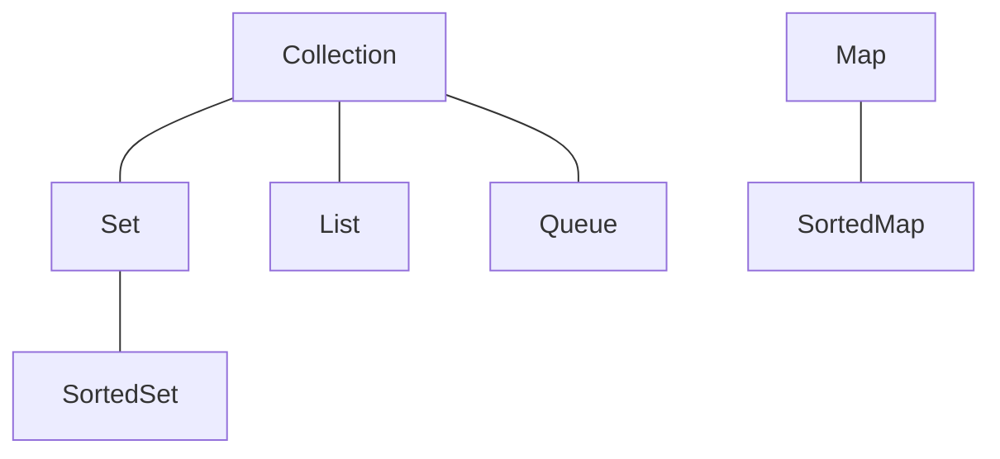

# Java语言高级特性

[TOC]

## 第一章：Java多线程编程

### 1.进程与线程

线程在进程的基础之上应用起来的。

### 2.Thread类实现多线程

继承Thread类就为线程主体类，必须覆写run方法，run为线程的主体方法。

多线程要执行的功能都应该在run方法中进行定义，但是run方法是不能直接被调用的，要想使用多线程必须使用start方法。

*为什么不直接使用run方法？*

使用start方法调用start0方法，使JVM调用系统对应的多线程底层函数执行相应的算法。

### 3.Runnable接口实现多线程

由于Java中存在单继承限制，提供Runnable接口。

### 4.Thread与Runnable关系

Thread类也是Runnable的子类。

### 5.Callable接口实现多线程

Runnable接口没有返回值，Callable接口就是为了解决这一缺点。

**面试题：**请解释Runnable与Callable的区别？

- Runnable是在JDK1.0的时候提出的多线程的实现接口，而Callable是在JDK1.5之后提出的
- java.lang.Runnable接口之中只提供一个run方法，并且没有返回值
- java.util.concurrent.Callable接口提供有call方法，可以有返回值

### 6.多线程运行状态


## 第二章：线程常用操作方法

### 1.线程的命名和取得

设置线程的名字：

- 构造方法：public Thread(Runnable target,String name);
- 设置名字：public final void setName(String name);
- 取得名字：public final String getName();

没有给线程命名时，由系统自动为线程分配序号。当每启动一个Java程序，系统就启动一个JVM进程。main线程进行程序步骤的控制，子线程进行耗时操作。

### 2.线程休眠

希望线程可以暂缓一些，使线程休眠。

- 休眠：public static void sleep(long millis) throws InterruptedException;
- 休眠：public static void sleep(long millis,int nanos) throws InterruptedException;

出现错误会产生InterruptedException异常，该异常是Exception的子类，因此必须强制处理。

### 3.线程中断

线程可以由另一个线程中断，所有正在执行的线程都是可以被中断的，中断线程必须进行异常处理。

### 4.线程强制运行

希望线程独占执行，可以使线程强制执行。

- 强制执行：public final void join() throws InterruptedException;

在进行线程强制执行的时候一定要获取强制执行线程对象之后才可以执行join()调用。

### 5.线程礼让

礼让指先将资源让出去。

- 礼让：public static yield();

礼让执行时调用yield方法，只执行一次。

### 6.线程优先级

理论上讲优先级越高越可能抢占到资源。

- 设置优先级：public final void setPriority(int newPriority)
- 获取优先级：public final int getPriority();

优先级通过int型数字来完成。

- 最高优先级：public static dinal int MAX_PRIORITY、10;
- 中等优先级：public static dinal int NORM_PRIORITY、5;
- 最低优先级：public static dinal int MIN_PRIORITY、1;

优先级有可能先执行，但并不一定先执行。

主线程属于中等优先级，默认创建的线程也是中等优先级。

## 第三章：线程的同步与死锁

### 1.同步问题的引出

多个线程同时操作同一内存空间。

### 2.线程同步处理

解决同步的问题是锁，在程序中实现锁的功能，使用synchronized关键字。

1. 利用同步代码块进行处理

```
sychronized(同步对象){
	同步代码操作;
}
```

加入同步处理之后程序的整体性能下降了，同步实际上会造成性能降低。

2. 利用同步方法解决：在方法的定义时加上synchronized关键字

### 3.线程死锁

死锁就是若干线程彼此等待的情况。若干个线程访问同一资源要使用同步处理，但过多的同步处理要造成死锁的出现。

## 第四章：多线程深入话题

### 1.优雅的停止线程

停止线程可以使用stop方法，但是从JDK1.2之后就不推荐使用stop方法。

- 停止多线程：public void stop();
- 销毁多线程：public void destory();
- 挂起线程：public final void suspend()、暂停执行；
- 恢复挂起的线程执行：public final void resume();

这些方法会导致死锁，因此JDK1.2之后不推荐使用。

**停止线程示例：**

```
package cn.mldn.demo;

public class ThreadDemo{
	public static boolean flag = ture;
	public static void main(String[] args){
		new Thread(() -> {
			long num = 0;
			while (flage){
				try {
					Thread.sleep(50);
				} catch (InterruptedException e) {
					e.printStackTrace();
				}
				System.out.println(Thread.currentThread().getName() + "正在运行、num = " + num ++)
			}
		}, "执行线程").start();
		Thread.sleep(200); 	// 运行200毫秒
		flag = false;		// 停止线程
	}
}
```

### 2.后台守护线程

随主线程一直执行下去，并且运行在后台状态。

在Thread类里面提供有如下的守护线程的操作方法：

- 设置为守护线程：public final void setDaemon(boolean on);
- 判断是否为守护线程：public final boolean isDaemon();

所有的守护线程都是围绕在用户线程的周围，如果用户线程都结束了，守护线程也会结束。

### 3.volatile关键字

volatile关键字用在属性定义上，表示属性为直接操作，在一些书上将其错误的理解为同步属性。

在正常进行变量处理的时候往往会经历如下几个步骤：

- 获取变量原有的数据内容副本；
- 利用副本为变量进行数学计算；
- 将计算后的变量，保存到原始空间之中；

volatile是直接操作原始数据，不进行数据副本的操作。

**面试题：**请解释volatile与synchronized的区别？

- volatile主要在属性上使用，而synchronized是在代码块与方法上使用的；
- volatile无法描述同步处理，它只是一种直接内存的处理，避免了副本的操作

## 第五章：Java基础类库

### 1.StringBuffer类

StringBuffer类专门用来处理字符串内容需要更改的对象，StringBuffer类要像普通类对象一样实例化。

- 构造方法：public StringBuffer();
- 构造方法：public StringBuffer(String str)，接收初始化内容；
- 数据追加：public StringBuffer append(数据类型 变量)；

“+”在编译之后就变成了StringBuffer的append方法。

### 2.CharSequence接口

只要有字符串就能用CharSequence接口实例化。

### 3.AutoCloseable接口

AutoCloseable接口主要用于资源开发的处理上，以实现资源的自动关闭（释放）。

但类对象或接口光继承AutoCloseable无法起作用，还应该配套使用异常处理。

继承AutoCloseable实现自动关闭需要覆写close方法。

### 4.Runtime类

Runtime描述的是运行时的状态，整个JVM之中Runtime是唯一一个与JVM状态有关的类，并且都会默认提供有该类的实例化对象。

由于每一个JVM进程只允许提供一个Runtime类的对象，因此Runtime类的构造方法被私有化了。该类使用的是单例设计模式，并且会提供一个static方法获取本类实例。获取实例化对象使用getRuntime方法。

Runtime类中四个最重要的方法：

- 获取最大可用内存空间：public long maxMemory()，默认为本机系统内存的四分之一；
- 获取可用内存空间：public long totalMemory()，默认为本机内存的六十四分之一；
- 获取空闲内存空间：public long freeMemory()
- 手工进行GC处理：public void gc()

**面试题：**请问什么是GC？如何处理？

- GC（Garbage Collector）垃圾收集器，是可以由系统自动调用的垃圾释放功能，或者使用Runtime类中的gc()手工调用。

### 5.System类

重要处理方法：

- 数组拷贝：public static void arraycopy(Object src,int srcPos,Object dest,int destPos,int length)


- 获取当前的日期时间数值：public static long currentTimeMillis()

- 进行垃圾回收：public static void gc()，是直接调用Runtime.gc()方法。

### 6.Cleaner类

### 7.对象克隆

## 第六章：数字操作类

### 1.Math数学计算类

math的构造方法为私有化，但不是单例，math的所有方法都是静态的。

### 2.Random随机数生成类

产生随机数的类。

### 3.大数字处理类

BigInteger、BigBigDecimal类继承自Number类。Math的处理性能高于大数字处理类。

## 第七章：日期操作类

### 1.Date日期处理

java.util.data，直接实例化就可以显示当前事件。

Date类只是对long数据的一种包装。

### 2.SimpleDateFormat日期处理类

Date类输出的时间格式不习惯。该类是DateFormat的子类。

String字符串可以向所有数据类型转换。

## 第八章：正则表达式

### 1.认识正则表达式

正则表达式主要用于字符串的验证处理。

### 2.常用正则标记

- 【数量：单个】字符匹配
	- 任意字符：表示由任意字符组成
	- \\\\：匹配“\”
	- \\n：匹配换行
	- \\t：匹配制表符
- 【数量：单个】匹配字符集（可以从里面任选一个字符）
	- [abc]：表示可能是字母a、b、c中的任意一个
	- [^abc]：表示不是由a、b、c中的任意一个字母组成
	- [a-zA-Z]：表示由任意一个字母组成，不区分大小写
	- [0-9]：表示由一位数字组成
- 【数量：单个】简化字符集
	- .：表示任意的一个字符
	- \\d：等价于“[0-9]”范围
	- \\D：等价于“[\^0-9]”范围
	- \\s：匹配任意的一位空格，可能是空格、换行、制表符
	- \\S：匹配任意的非空格数据
	- \\w：匹配字母、数字、下划线，等价于“[a-zA-z_0-9]”
	- \\W：匹配非字母、数字、下划线，等价于“[\^a-zA-z_0-9]”
- 边界匹配
	- ^：匹配边界开始
	- $：匹配边界结束
- 数量表示，默认情况下只有添加上了数量单位才可以匹配多位字符
	- 表达式？：该正则可以出现0次或1次
	- 表达式*：该正则可以出现0次、1次或多次
	- 表达式+：该正则可以出现1次多多次
	- 表达式{n}，：表达式的长度正好为n次
	- 表达式{n，}：表达式的长度为n次以上
	- 表达式{n，m}：表达式的长度在n~m次
- 逻辑表达式：可以连接多个正则
	- 表达式X表达式Y：X表达式之后紧跟上Y表达式
	- 表达式X|表达式Y：有一个表达式满足即可
	- (表达式)：为表达式设置一个整体描述，可以为整体设置数量单位

### 3.String类对正则的支持

### 4.java.util.regex包支持

如果只是匹配、替换、拆分更本用不到java.util.regex。

## 第九章：国际化程序实现

### 1.国际化程序实现原理

实现国际化程序的两部重要的信息：

- 如何可以定义保存文字的文件信息
- 如何根据不同的区域语言的编码读取指定的资源

### 2.Locale类

### 3.ResourceBundle读取资源文件

### 4.实现国际化程序开发

### 5.格式化文本显示

## 第十章：开发支持类库

### 1.UUID类

更具时间戳产生无重复字符串。

### 2.Optional类

主要进行null的相关处理。

### 3.ThreadLocal类

### 4.定时调度

### 5.Base64加密与解密

## 第十一章：比较器

## 第十二章：文件操作

### 1.File类基本操作

File类是Java中唯一一个与文件本身相关的类。File是comparable接口的子类，File类对象是可以进行排序处理的。

- 构造方法：public File(String pathname)，设置要操作完整路径
- 构造方法：public File(String parent, String child)，设置父路径与子目录路径
- 创建新的文件：public boolean createNewFile() throws IOException
- 判断文件是否存在：public boolean exists()
- 删除文件：public boolean delete()

### 2.File类操作深入

为解决Windows和Linux系统文件分隔符不同，File类提供有一个常量：public static final String separator；

重复删除或创建的时候有可能会出现有延迟的问题，所以这个时候最好的方案是别重命名；

文件创建的一个前提：文件的父路径不必须存在；

- 如何获取父目录：public File getParentFile()
- 创建目录：public boolean mkdirs()

### 3.获取文件信息

File类可以获取如下文件信息：

- 文件是否可读：public boolean canRead()
- 文件是否可写：public boolean canWrite()
- 获取文件长度：public long length()、该方法返回的是long数据类型、返回的是字节长度
- 最后一次修改的时间：public boolean setLastModified(long time)
- 判断是否是目录：public boolean isDirectory()
- 判断是否是文件：public boolean isFile()
- 列出目录内容：public File[] listFiles()

## 第十三章：字节流与字符流

### 1.流的基本概念

对于服务器端客户端传输的就是一种流数据，而所谓的流就是比特数据。

java.io中的流处理：

- OutputStream字节输出流、InputStream字节输入流
- Write字符输出流、Reader字符输入流

所有的流操作都应该采用如下统一的操作流程：

- 一定要通过File类找到一个文件
- 通过字节流或字符流的子类为父类对象实例化
- 利用字节流或字符流中的方法实现数据的输入与输出操作
- 流的操作属于资源操作，资源操作必须进行关闭处理

### 2.OutputStream字节输出流

字节的数据以byte数据类型为主实现的操作。OutputStream类定义的是一个公共的输出操作标准，其定义有如下方法：

| No   | 方法名称                                                     | 类型 | 描述             |
| ---- | ------------------------------------------------------------ | ---- | :--------------- |
| 01   | public void write(int b) throws IOException                  | 普通 | 输出单个字节数据 |
| 02   | public void write(byte[] b) throws IOException               | 普通 | 输出一组字节数据 |
| 03   | public void write(byte[] b, int off, int len) throws IOException | 普通 | 输出部分字节数据 |

OutputStream类为抽象类，要进行对象实例化要通过子类对象向上转型。FileOutputStream是文件操作中OutputStream的子类。

- 【覆盖】构造方法：public FileOutputStream(File file) throws FileNotFoundException
- 【追加】构造方法：public FileOutputStream(File file, boolean append) throws FileNotFoundException

### 3.InputStream字节输入流

InputStream类核心方法：

| No   | 方法名称                                                     | 类型 | 描述                         |
| :--- | :------------------------------------------------------- | ------ | ------------------------------ |
| 01   | public abstract int read() throws IOException                | 普通 | 读取单个字节数据，如果现在已经读取到底了，返回-1 |
| 02   | public int read(byte[] b) throws IOException                 | 普通 | 读取一组字节数据，返回的是读取的个数，如果没有数已经读取到底了则返回-1 |
| 03   | public int read(byte[] b, int off, int len) throws IOException | 普通 | 读取一组数据（只占数组部分） |

InputStream类属于抽象类，它的使用依赖于它的子类向上转型对象实例化，FileInputStream是InputStream类的文件操作子类，其核心方法：

- 构造方法：public FileInputStream(File file) throws FileNotFoundException
- 构造方法：public FileInputStream(FileDescriptor fdObj)
- 构造方法：public FileInputStream(String name) throws FileNotFoundException

### 4.Writer字符输出流

OutputStream类为字节输出流，JDK1.1之后有推出了Writer字符输出流（对应使用的char字符类型），其定义如下：

```
public abstract class Writer extends Object implements Appendable, Closeable, Flushable
```

Writer类中提供有许多的输出操作方法，重点看两个：

- 输出字符数组：public abstract void write(char[] cbuf, int off, int len) throws IOException
- 输出字符串：public void write(String str) throws IOException

Writer是字符流，字符流最大的优势是中文处理。

### 5.Reader字符输入流

Reader定义如下：

```
public abstract class Reader extends Object implements Readable, Closeable
```

字符流只能够按照字符数组的形式读取数据。

### 6.字节流与字符流的区别

使用OutputStream进行输出时如果没有使用close()方法关闭输出流发现内容依然可以实现正常输出，使用Writer进行输出时，没有使用close()方法关闭输出流，那么内容将无法进行输出，因为Writer使用了缓冲区。

字节流处理不会使用缓冲区，字符流处理时使用了缓冲区。

### 7.转换流

流转换指字节流和字符流的转换。java.io中提供有两个类：OutputStreamWriter、InputStreamReader

| 类：       | **OutputStreamWriter**                         | **InputStreamReader**                         |
| :--------- | ---------------------------------------------- | --------------------------------------------- |
| 定义：     | public class OutputStreamWriter extends Writer | public class InputStreamReader extends Reader |
| 构造方法： | public OutputStreamWriter(OutputStream out)    | public InputStreamReader(InputStream in)      |

## 第十四章：IO操作深入

### 1.字符编码

都是用UTF-8编码。

### 2.内存操作流

需要IO操作但又不需要文件，可以使用内存操作流。

Java中提供有两类的内存操作流：

- 字节内存操作流：ByteArrayOutputStream、ByteArrayInputStream；
- 字符内存操作流：CharArrayWriter、CharArrayReader；

### 3.管道流

实现两个线程之间的IO操作。管道流依然分为字节流和字符流。

- 字节管道流：PipedInputStream、PipedOutputStream
    - 连接处理：public void connect(PipedInputStream snk) throws IOException
- 字符管道流：PipedWriter、PipedReader
    - 连接处理：public void connect(PipedReader snk) throws IOException

### 4.RandomAccessFile

## 第十五章：类集框架

### 一、综述

Java集合框架定义了几个接口，这些接口决定类Collection类的基本特性。不同的是具体类仅仅提供了标准接口的不同实现。



从图可知，Java结合类的主要是由两个接口派生而出——Collection和Map，Collection和Map是集合框架的根接口。


### 1.类集框架简介

类集指的是一套动态数组的实现方案，重要的两个结构：链表、树，但是面对这些数据结构的实现又不得不面对如下问题：

- 数据结构的代码实现困难，对于一般的开发者是无法使用的；
- 对于链表或二叉树当进行更新处理的时候的维护是非常麻烦的；
- 对于链表或二叉树好需要尽可能保证其操作的性能

受Java本身的技术所限，最初对于数据的控制并不严格，全部采用Object类型进行数据接收，JDK1.5之后由于泛型技术的推广，所以类集本身也得到了良好的改进。

在整个类集框架里面提供有如下几个核心接口：Collection、List、Set、Map、Iterator、Enumeration、Queue、ListIterator。

### 2.Collection接口简介

java.util.Collection是单值集合操作的最大的父接口，在该接口之中定义有所有的单值数据的处理操作，这个接口定义有如下核心方法：

| No   | 方法名称                                         | 类型 | 描述                                   |
| ---- | ------------------------------------------------ | ---- | -------------------------------------- |
| 01   | public boolean add(E e)                          | 普通 | 向集合保存数据                         |
| 02   | public boolean addAll(Collection<? extends E> c) | 普通 | 追加一组数据                           |
| 03   | public void clear()                              | 普通 | 清空集合，让根节点为空，同时进行GC处理 |
| 04   | public boolean contains(Object o)                | 普通 | 查询数据是否存在，依赖equals支持       |
| 05   | public boolean remove(Object o)                  | 普通 | 数据删除，需要equals（）方法支持       |
| 06   | public int size()                                | 普通 | 获取数据长度                           |
| 07   | public Object[] toArray()                        | 普通 | 将集合变为对象数组返回                 |
| 08   | public Iterator\<E> iterator()                   | 普通 | 将集合变为Iterator接口                 |

集合操作的两个最为常用的方法：【增加】add()、【输出】Iterator()，在JDK1.5之前Collection只是一个独立的接口，从JDK1.5之后提供有了Iterable父接口，并且JDK1.8之后针对Iterable接口也得到了一些扩充。在JDK1.2～JDK1.4时进行集合的使用往往会直接操作Collection接口，JDK1.5之后很多情况是操作它的子接口：【可重复】List子接口、【不可重复】Set子接口。

## 第十六章：List集合

### 1.List接口简介

List是Collection子接口，允许保存有重复元素数据。接口定义：

public interface List\<E> extends Collection\<E>

List对Collection的方法进行了扩充。

| No   | 方法名称                               | 类型 | 描述                 |
| ---- | -------------------------------------- | ---- | -------------------- |
| 01   | public E get(int index)                | 普通 | 获取指定索引上的数据 |
| 02   | public E set(int index,     E element) | 普通 | 修改指定索引数据     |
| 03   | public ListIterator\<E> listIterator() | 普通 | 返回ListIterator接口 |

List本身依然是一个接口，对于接口的使用一定要使用子类来完成，List的三个重要的子类有：ArrayList、Vector、LinkedList。

### 2.ArrayList子类

List集合存储的特征：

- 保存的循序就是其存储顺序
- List集合里面允许存在有重复数据

以上集合的输出是利用每一个类提供的toString方法实现的，在JDK1.8之后Iterable父接口定义有forEach方法，方法定义：

### 3.ArrayList保存自定义类对象

进行自定义类对象contains、remove方法时必须复写equals方法。

### 4.LinkedList子类

面试题：请问ArrayList与LinkedList有什么区别？

- ArrayList是数组实现的集合操作，而LinkedList是链表实现的集合操作
- 在使用List集合中的get方法时，ArrayList的时间复杂度为O(1)，而LinkedList的时间复杂度为O(n)
- ArrayList默认初始化数组长度为10，如果空间不足会采用2倍扩充，如果保存大数据量的时候会造成垃圾的产生，这个时候可以使用LinkedList

### 5.Vector子类

Vector的使用和ArrayList相同，Vector类之中的操作方法采用的都是synchronized同步处理，而ArrayList没有采用。

## 第十七章：Set集合

### 1.Set接口简介

Set集合最大的特点是不允许保存重复元素。Set使用of方法保存重复数据会直接抛出异常，Set的实现子类有HashSet、TreeSet。

### 2.HashSet子类

HashSet主要的特点是保存的数据是无序的。

### 3.TreeSet子类

TreeSet保存的数据是有序的。

## 第十八章：集合输出

### 1.Iterator迭代输出

Collection接口中定义有remove方法，但是Iterator使用Collection中的删除方法的会导致迭代失败。

面试题：请解释Collection.remove()与Iterator.remove()的区别？

- 在进行迭代输出时如果使用了Collection.remove()方法会导致迭代失败

### 2.ListIterator双向迭代输出

Iterator是单向的输出，要进行双向的输出应使用Iterator的子接口ListIterator。需要注意的是如果要获取ListIterator接口对象Collection并没有定义有相关的方法，但是List子接口定义有相关方法。

ListIterator中定义的方法：

- 判断是否有前一个元素：public boolean hasPrevious()
- 获取当前元素：public E previous()

如果要实现由后向前的遍历，首先要实现由前向后实现遍历。

### 3.Enumeration枚举输出

从JDK1.0就开始使用，主要为Vector服务。要获取Enumeration接口对象，通过Vector类对象的方法实现。

- 获取Enumeration：public Enumeration<E> elements()

在Enumeration接口之中定义有两个操作方法：

- 判断是否有下一个元素：public boolean hasMoreElements()
- 获取当前元素：public E nextElement()

### 4.foreach输出

加强型for循环。

## 第十九章：Map集合

### 1.Map接口简介

Collection接口中保存的都是单个对象，实际上也可以进行二元偶对象的保存。Map接口是二元偶对象的最大接口，定义如下：public interface Map<K,V>

该接口为一个独立的父接口，并且在进行接口对象实例化的时候需要设置Key与Value的类型。

Map核心方法：

| No   | 方法名称                               | 类型 | 描述                        |
| ---- | -------------------------------------- | ---- | --------------------------- |
| 01   | public V put(K key,     V value)       | 普通 | 向集合之中保存数据          |
| 02   | public V get(Object key)               | 普通 | 根据Key查询数据             |
| 03   | public Set<Map.Entry<K,V>> entrySet()  | 普通 | 将Map集合转为Set集合        |
| 04   | public boolean containsKey(Object key) | 普通 | 查询制定的Key是否存在       |
| 05   | public Set\<K> keySet()                | 普通 | 将Map集合中的Key转为Set集合 |
| 06   | public V remove(Object key)            | 普通 | 根据Key删除数据             |

JDK1.9之后Map接口扩充了许多静态方法供用户使用。

Map接口常用的子类：HashMap、Hashtable、TreeMap、LinkedHashMap。

### 2.HashMap子类

HashMap是Map接口之中最为常见的一个子类，该类的主要特点是无序存储，定义形式：

```
public class HashMap<K,V>
extends AbstractMap<K,V>
implements Map<K,V>, Cloneable, Serializable
```

HashMap特点：

- HashMap中的Key或value可以保存null的数据
- 保存重复的Key也不会出现错误，会发生内容的替换
- 设置相同的Key内容时，put()方法会返回原始数据内容

**面试题**：在进行HashMap的put()操作的时候，如何实现容量扩充？

- 在HashMap类里面提供有一个“DEFAULT_INITIAL_CAPACITY”常量，作为初始化HashMap容量最小为16个元素，默认可以保存的最大内容是16
- 当保存的内容的容量超过了这个阈值（DEFAULT_LOAD_FACTOR = 0.75f），相当于“容量默认值 * 阈值 = 12”的时候就会进行容量的扩充

面试题：请解释HashMap的工作原理（JDK1.8之后开始的）

-   在HashMap之中进行数据存储依然利用了Node类完成的，这种情况下就证明可以使用的数据结构只有：链表（时间复杂度O(n)）、二叉树（时间复杂度O(logn)）
-   从JDK1.8开始，因为要适应于大数据时代的海量数据问题，所以对于其存储发生了改变，并且在HashMap内部提供有一个重要的常量：“    static final *int* TREEIFY_THRESHOLD = 8;”，在使用HashMap进行数据保存时，如果保存的数据没有操作阈值8，那么会按照链表的形式进行存储，如果操作阈值，则会将链表转为红黑树以实现树的平衡，并且利用左旋与右旋保证数据的查询性能。

### 3.LinkedHashMap子类

想要使HashMap保存数据为添加顺序，可以使用LinkedHashMap子类保存数据。

### 4.Hashtable子类

Hashtable类是从JDK1.0的时候提供的，与Vector、Enumeration属于最早的一批动态数组的实现类，后来多实现了一个Map接口。在Hashtable里面设置的Key和value都不能为null，否则会报错。

面试题：请解释HashMap与Hashtable的区别？

-   HashMap中的 方法都属于异步操作（非线程安全），HashMap允许保存有null数据
-   Hashtable中的方法都属于同步方法（线程安全），Hashtable不允许保存null数据，否则报错

### 5.Map.Entry内部接口

Map.Entry的主要作用就是作为Key和value的集合点，Map.Entry作为Key和value的包装类。

### 6.利用Iterator输出Map集合

Map接口中不直接提供Iterator，如果要使用Iterator实现Map集合的输出必须按照如下步骤处理：

-   利用Map接口中提供的entrySet()方法将Map集合转为Set集合
-   利用Set接口中的Iterator()方法将Set集合转为Iterator接口实例
-   利用Iterator进行迭代输出获取每一组的Map.Entry对象，对吼哦通过getKey()与getValue()获取数据

### 7.自定义Map的key类型

对于自定义Key类型所在的类中一定要覆写hashCode和equals方法，否则我们无法查找到。

面试题：如果在进行HashMap进行数据操作的时候出现了Hash冲突（Hash码相同），HashMap是如何解决的？

当出现Hash冲突的时候为了保证程序的正常执行，会在冲突的位置上将所有Hash冲突的内容转为链表保存。

## 第二十章：认识反射机制

### 1.反射机制简介

Java语言之所以有如此众多的开源技术支撑，很大一部分是由于Java的反射机制。所有的技术实现的目标只有一点：重用性。

对于反射技术首先考虑的是“反”与“正”的操作，所谓的“正”操作指的是当我们使用一个类的时候，一定先导入程序所在的包，而后根据包使用类对象。而“反”的操作是根据类对象反推出对象的类型。

如果要实现反的处理操作，首先采用的就是Object类中提供的操作方法：

-   获取Class对象信息：public final Class<?> getClass()

### 2.Class类对象的三种实例化模式

反射机制的核心操作都是通过Class类对象展开的，要获得Class类的实例化对象可以采用三种方式完成。

1.  【object类支持】Object类可以根据实例化对象获取Class对象：public final Class<?> getClass()
    -   这种方式的缺陷：如果只是想获得Class类对象，则必须产生指定类对象后才可以获得
2.  【JVM直接支持】采用“类.class”的形式实例化
    -   特点：如果要采用此种模式，则必须导入程序所对应的开发包
3.  【Class类支持】在Class类中提供有一个static方法：
    -   加载类：public static Class<?> forName(String className) throws ClassNotFoundException
    -   这种模式最大的特点是可以直接采用字符串的形式定义要使用的类型，并且程序中不需要编写任何的import语句。如果此时要使用的类型对象不存在则会抛出"java.lang.ClassNotFoundException"异常。

