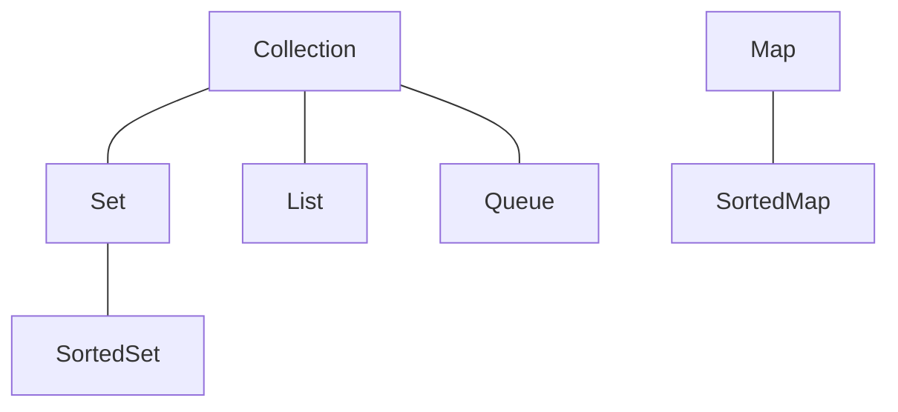

# Java语言高级特性

[TOC]

## 第一章：进程与线程

### 一、进程、线程基本概念

-   进程：进程表示系统资源分配的基本单位
-   线程：线程是进程中执行运算的最小单位
-   线程与进程的比较
    -   调度：线程为系统调度和分派的基本单位，进程是拥有资源的基本单位
    -   并发性：进程让操作系统的并发成为可能，线程让进程内部并发成为可能
    -   拥有资源：进程是系统分配资源的最小单位
    -   系统开销：操作进程的开销远远大于操作线程的开销

### 二、线程的实现

#### 1.继承Thread类创建线程类

继承Thread类创建线程必须覆写run()方法；调用线程时必须调用start()方法；

代码示例：

```java
package com.smallseven.demo;

class MyThread extends Thread{// 继承Thread类实现多线程
    private String threadName;
    
    public MyThread(String name){
        this.threadName = name;
    }
    
    @Override
    public void run(){// 覆写run()方法
        for (int i = 0; i < 10; i++){
            System.out.println(this.name + ",i=" + i);
        }
    }
}

public class TestDemo{
    public static void main(String[] args){
        MyThread thread1 = nw MyThread("线程A");// 创建线程
        MyThread thread1 = nw MyThread("线程B");
        MyThread thread1 = nw MyThread("线程C");
        
        thread1.start();// 启动线程调用start()方法
        thread2.start();
        thread3.start();
    }
}
```

启动线程调用start方法方法时程序交替执行，调用run方法时按顺序执行。

#### 2.继承Runnable接口创建线程类

继承Thread类有单继承的局限性，Runnable接口能够很好的解决这个问题。

代码示例：

```java
package com.smallseven.demo;

class MyRunnable implements Runnable{// 继承Runnable接口
    private String threadName;
    
    public MyRunnable(String name){
        this.threadName = name;
    }
    
    @Override
    public void run(){// 覆写run方法
        for (i = 0; i < 10; i++){
            System.out.println(this.threadName + ",i=" + i);
        }
    }
}

public class RunnableDemo{
    public static void main(String[] args){
        MyRunnable thread1 = new MyRunnable("线程A");// 创建Runnable实体类
        MyRunnable thread2 = new MyRunnable("线程A");
        MyRunnable thread3 = new MyRunnable("线程A");
        
        new Thread(thread1).start();// 创建Thread类并加载Runnable接口实体类
        new Thread(thread2).start();
        new Thread(thread3).start();
    }
}
```

#### 3.通过Callable和Future创建线程

JDK1.5之后对于多线程的实现多了一个Callable接口，相比与Runnable接口此接口最大的特点在于它能返回执行结果。Callable接口中的call()方法相当于Thread的run()方法，因此实现接口必须覆写call()方法。

代码示例：

```java
package com.smallseven.demo;

class MyCallable implements Callable<String>{// 继承Callable接口，泛型表示返回值的类型
    private int ticket = 5;
    private String name;
    
    public MyCallable(String name){
		this.name = name;
    }
    
    @Override
    public String call(){// 覆写call方法
		for (int i = 0; i < 10; i++){
            if (this.ticket > 0){
                System.out.println(name + "买票，ticket = " + this.ticket--);
            }
        }
        return "票买完了";
    }
}

public class CallableDemo{
    public static void main(String[] args){
        MyCallable mc = new MyCallable("Call线程：");// 创建Callable接口实体类
        
        FutureTask<String> futureTask = new FutureTask<>(mc);// 创建FutureTask类接收线程执行结果
        Thread thread = new Thread(futureTask);// 创建Thread类并加载Callable接口实体类
        thread.start();
        System.out.println("返回值 = [" + futureTask.get() + "]");
    }
}
```

**面试题：**请解释Runnable与Callable的区别？

- Runnable是在JDK1.0的时候提出的多线程的实现接口，而Callable是在JDK1.5之后提出的
- java.lang.Runnable接口之中只提供一个run方法，并且没有返回值
- java.util.concurrent.Callable接口提供有call方法，可以有返回值

#### 4.通过线程池创建线程

### 三、线程常用操作方法

#### 1.线程的命名和取得

设置线程的名字：

- 构造方法：public Thread(Runnable target,String name);
- 设置名字：public final void setName(String name);
- 取得名字：public final String getName();

没有给线程命名时，由系统自动为线程分配序号。当每启动一个Java程序，系统就启动一个JVM进程。main线程进行程序步骤的控制，子线程进行耗时操作。

#### 2.线程休眠

希望线程可以暂缓一些，使线程休眠。

- 休眠：public static void sleep(long millis) throws InterruptedException;
- 休眠：public static void sleep(long millis,int nanos) throws InterruptedException;

出现错误会产生InterruptedException异常，该异常是Exception的子类，因此必须强制处理。

#### 3.线程中断

线程可以由另一个线程中断，所有正在执行的线程都是可以被中断的，中断线程必须进行异常处理。

#### 4.线程强制运行

希望线程独占执行，可以使线程强制执行。

- 强制执行：public final void join() throws InterruptedException;

在进行线程强制执行的时候一定要获取强制执行线程对象之后才可以执行join()调用。

#### 5.线程礼让

礼让指先将资源让出去。

- 礼让：public static yield();

礼让执行时调用yield方法，只执行一次。

#### 6.线程优先级

理论上讲优先级越高越可能抢占到资源。

- 设置优先级：public final void setPriority(int newPriority)
- 获取优先级：public final int getPriority();

优先级通过int型数字来完成。

- 最高优先级：public static dinal int MAX_PRIORITY、10;
- 中等优先级：public static dinal int NORM_PRIORITY、5;
- 最低优先级：public static dinal int MIN_PRIORITY、1;

优先级有可能先执行，但并不一定先执行。

主线程属于中等优先级，默认创建的线程也是中等优先级。

### 四、线程的同步与死锁

#### 1.同步问题的引出

多个线程同时操作同一内存空间。

#### 2.线程同步处理

解决同步的问题是锁，在程序中实现锁的功能，使用synchronized关键字

-   利用同步代码块处理

```java
synchronized(this){
	if (ticket > 0){
		try{
            Thread.sleep(10);
        }catch(InterruptedException e){
            e.ptintStackTrace();
        }
        System.out.print(Thread.currentThread().getName() + ",剩余ticket=" + this.ticket--);
    }
}
```

加入同步处理之后程序的整体性能下降了，同步实际上会造成性能降低。

-   利用同步方法处理

```java
public synchronized void sale(){
	if (ticket > 0) {
            try {
                Thread.sleep(100);
            } catch (InterruptedException e) {
                e.printStackTrace();
            }
           System.out.println(Thread.currentThread().getName() + ",剩余ticket=" + this.ticket--);
    }
}
```

#### 3.线程死锁

死锁就是若干线程彼此等待的情况。若干个线程访问同一资源要使用同步处理，但过多的同步处理要造成死锁的出现。

### 五、多线程深入话题

#### 1.优雅的停止线程

停止线程可以使用stop方法，但是从JDK1.2之后就不推荐使用stop方法。

- 停止多线程：public void stop();
- 销毁多线程：public void destory();
- 挂起线程：public final void suspend()、暂停执行；
- 恢复挂起的线程执行：public final void resume();

这些方法会导致死锁，因此JDK1.2之后不推荐使用。

**停止线程示例：**

```
package cn.mldn.demo;

public class ThreadDemo{
	public static boolean flag = ture;
	public static void main(String[] args){
		new Thread(() -> {
			long num = 0;
			while (flage){
				try {
					Thread.sleep(50);
				} catch (InterruptedException e) {
					e.printStackTrace();
				}
				System.out.println(Thread.currentThread().getName() + "正在运行、num = " + num ++)
			}
		}, "执行线程").start();
		Thread.sleep(200); 	// 运行200毫秒
		flag = false;		// 停止线程
	}
}
```

#### 2.后台守护线程

随主线程一直执行下去，并且运行在后台状态。

在Thread类里面提供有如下的守护线程的操作方法：

- 设置为守护线程：public final void setDaemon(boolean on);
- 判断是否为守护线程：public final boolean isDaemon();

所有的守护线程都是围绕在用户线程的周围，如果用户线程都结束了，守护线程也会结束。

#### 3.volatile关键字

volatile关键字用在属性定义上，表示属性为直接操作，在一些书上将其错误的理解为同步属性。

在正常进行变量处理的时候往往会经历如下几个步骤：

- 获取变量原有的数据内容副本；
- 利用副本为变量进行数学计算；
- 将计算后的变量，保存到原始空间之中；

volatile是直接操作原始数据，不进行数据副本的操作。

**面试题：**请解释volatile与synchronized的区别？

- volatile主要在属性上使用，而synchronized是在代码块与方法上使用的；
- volatile无法描述同步处理，它只是一种直接内存的处理，避免了副本的操作

## 第二章：Java类库

### 一、Java基础类库

#### 1.StringBuffer类

StringBuffer类专门用来处理字符串内容需要更改的对象，StringBuffer类要像普通类对象一样实例化。

- 构造方法：public StringBuffer();
- 构造方法：public StringBuffer(String str)，接收初始化内容；
- 数据追加：public StringBuffer append(数据类型 变量)；

“+”在编译之后就变成了StringBuffer的append方法。

#### 2.CharSequence接口

只要有字符串就能用CharSequence接口实例化。

#### 3.AutoCloseable接口

AutoCloseable接口主要用于资源开发的处理上，以实现资源的自动关闭（释放）。

但类对象或接口光继承AutoCloseable无法起作用，还应该配套使用异常处理。

继承AutoCloseable实现自动关闭需要覆写close方法。

#### 4.Runtime类

Runtime描述的是运行时的状态，整个JVM之中Runtime是唯一一个与JVM状态有关的类，并且都会默认提供有该类的实例化对象。

由于每一个JVM进程只允许提供一个Runtime类的对象，因此Runtime类的构造方法被私有化了。该类使用的是单例设计模式，并且会提供一个static方法获取本类实例。获取实例化对象使用getRuntime方法。

Runtime类中四个最重要的方法：

- 获取最大可用内存空间：public long maxMemory()，默认为本机系统内存的四分之一；
- 获取可用内存空间：public long totalMemory()，默认为本机内存的六十四分之一；
- 获取空闲内存空间：public long freeMemory()
- 手工进行GC处理：public void gc()

**面试题：**请问什么是GC？如何处理？

- GC（Garbage Collector）垃圾收集器，是可以由系统自动调用的垃圾释放功能，或者使用Runtime类中的gc()手工调用。

#### 5.System类

重要处理方法：

- 数组拷贝：public static void arraycopy(Object src,int srcPos,Object dest,int destPos,int length)


- 获取当前的日期时间数值：public static long currentTimeMillis()

- 进行垃圾回收：public static void gc()，是直接调用Runtime.gc()方法。

#### 6.Cleaner类

#### 7.对象克隆

### 二、数字操作类

#### 1.Math数学计算类

math的构造方法为私有化，但不是单例，math的所有方法都是静态的。

#### 2.Random随机数生成类

产生随机数的类。

#### 3.大数字处理类

BigInteger、BigBigDecimal类继承自Number类。Math的处理性能高于大数字处理类。

### 三、日期操作类

#### 1.Date日期处理

java.util.data，直接实例化就可以显示当前事件。

Date类只是对long数据的一种包装。

#### 2.SimpleDateFormat日期处理类

Date类输出的时间格式不习惯。该类是DateFormat的子类。

String字符串可以向所有数据类型转换。

## 第三章：正则表达式

### 一、认识正则表达式

正则表达式主要用于字符串的验证处理。

### 二、常用正则标记

- 【数量：单个】字符匹配
	- 任意字符：表示由任意字符组成
	- \\\\：匹配“\”
	- \\n：匹配换行
	- \\t：匹配制表符
- 【数量：单个】匹配字符集（可以从里面任选一个字符）
	- [abc]：表示可能是字母a、b、c中的任意一个
	- [^abc]：表示不是由a、b、c中的任意一个字母组成
	- [a-zA-Z]：表示由任意一个字母组成，不区分大小写
	- [0-9]：表示由一位数字组成
- 【数量：单个】简化字符集
	- .：表示任意的一个字符
	- \\d：等价于“[0-9]”范围
	- \\D：等价于“[\^0-9]”范围
	- \\s：匹配任意的一位空格，可能是空格、换行、制表符
	- \\S：匹配任意的非空格数据
	- \\w：匹配字母、数字、下划线，等价于“[a-zA-z_0-9]”
	- \\W：匹配非字母、数字、下划线，等价于“[\^a-zA-z_0-9]”
- 边界匹配
	- ^：匹配边界开始
	- $：匹配边界结束
- 数量表示，默认情况下只有添加上了数量单位才可以匹配多位字符
	- 表达式？：该正则可以出现0次或1次
	- 表达式*：该正则可以出现0次、1次或多次
	- 表达式+：该正则可以出现1次多多次
	- 表达式{n}，：表达式的长度正好为n次
	- 表达式{n，}：表达式的长度为n次以上
	- 表达式{n，m}：表达式的长度在n~m次
- 逻辑表达式：可以连接多个正则
	- 表达式X表达式Y：X表达式之后紧跟上Y表达式
	- 表达式X|表达式Y：有一个表达式满足即可
	- (表达式)：为表达式设置一个整体描述，可以为整体设置数量单位

### 三、String类对正则的支持

### 四、java.util.regex包支持

如果只是匹配、替换、拆分更本用不到java.util.regex。

## 第四章：IO操作

### 一、文件操作

#### 1.File类基本操作

File类是Java中唯一一个与文件本身相关的类。File是comparable接口的子类，File类对象是可以进行排序处理的。

- 构造方法：public File(String pathname)，设置要操作完整路径
- 构造方法：public File(String parent, String child)，设置父路径与子目录路径
- 创建新的文件：public boolean createNewFile() throws IOException
- 判断文件是否存在：public boolean exists()
- 删除文件：public boolean delete()

#### 2.File类操作深入

为解决Windows和Linux系统文件分隔符不同，File类提供有一个常量：public static final String separator；

重复删除或创建的时候有可能会出现有延迟的问题，所以这个时候最好的方案是别重命名；

文件创建的一个前提：文件的父路径不必须存在；

- 如何获取父目录：public File getParentFile()
- 创建目录：public boolean mkdirs()

#### 3.获取文件信息

File类可以获取如下文件信息：

- 文件是否可读：public boolean canRead()
- 文件是否可写：public boolean canWrite()
- 获取文件长度：public long length()、该方法返回的是long数据类型、返回的是字节长度
- 最后一次修改的时间：public boolean setLastModified(long time)
- 判断是否是目录：public boolean isDirectory()
- 判断是否是文件：public boolean isFile()
- 列出目录内容：public File[] listFiles()

### 二、字节流与字符流

#### 1.流的基本概念

对于服务器端客户端传输的就是一种流数据，而所谓的流就是比特数据。

java.io中的流处理：

- OutputStream字节输出流、InputStream字节输入流
- Write字符输出流、Reader字符输入流

所有的流操作都应该采用如下统一的操作流程：

- 一定要通过File类找到一个文件
- 通过字节流或字符流的子类为父类对象实例化
- 利用字节流或字符流中的方法实现数据的输入与输出操作
- 流的操作属于资源操作，资源操作必须进行关闭处理

#### 2.OutputStream字节输出流

字节的数据以byte数据类型为主实现的操作。OutputStream类定义的是一个公共的输出操作标准，其定义有如下方法：

| No   | 方法名称                                                     | 类型 | 描述             |
| ---- | ------------------------------------------------------------ | ---- | :--------------- |
| 01   | public void write(int b) throws IOException                  | 普通 | 输出单个字节数据 |
| 02   | public void write(byte[] b) throws IOException               | 普通 | 输出一组字节数据 |
| 03   | public void write(byte[] b, int off, int len) throws IOException | 普通 | 输出部分字节数据 |

OutputStream类为抽象类，要进行对象实例化要通过子类对象向上转型。FileOutputStream是文件操作中OutputStream的子类。

- 【覆盖】构造方法：public FileOutputStream(File file) throws FileNotFoundException
- 【追加】构造方法：public FileOutputStream(File file, boolean append) throws FileNotFoundException

#### 3.InputStream字节输入流

InputStream类核心方法：

| No   | 方法名称                                                     | 类型 | 描述                         |
| :--- | :------------------------------------------------------- | ------ | ------------------------------ |
| 01   | public abstract int read() throws IOException                | 普通 | 读取单个字节数据，如果现在已经读取到底了，返回-1 |
| 02   | public int read(byte[] b) throws IOException                 | 普通 | 读取一组字节数据，返回的是读取的个数，如果没有数已经读取到底了则返回-1 |
| 03   | public int read(byte[] b, int off, int len) throws IOException | 普通 | 读取一组数据（只占数组部分） |

InputStream类属于抽象类，它的使用依赖于它的子类向上转型对象实例化，FileInputStream是InputStream类的文件操作子类，其核心方法：

- 构造方法：public FileInputStream(File file) throws FileNotFoundException
- 构造方法：public FileInputStream(FileDescriptor fdObj)
- 构造方法：public FileInputStream(String name) throws FileNotFoundException

#### 4.Writer字符输出流

OutputStream类为字节输出流，JDK1.1之后有推出了Writer字符输出流（对应使用的char字符类型），其定义如下：

```
public abstract class Writer extends Object implements Appendable, Closeable, Flushable
```

Writer类中提供有许多的输出操作方法，重点看两个：

- 输出字符数组：public abstract void write(char[] cbuf, int off, int len) throws IOException
- 输出字符串：public void write(String str) throws IOException

Writer是字符流，字符流最大的优势是中文处理。

#### 5.Reader字符输入流

Reader定义如下：

```
public abstract class Reader extends Object implements Readable, Closeable
```

字符流只能够按照字符数组的形式读取数据。

#### 6.字节流与字符流的区别

使用OutputStream进行输出时如果没有使用close()方法关闭输出流发现内容依然可以实现正常输出，使用Writer进行输出时，没有使用close()方法关闭输出流，那么内容将无法进行输出，因为Writer使用了缓冲区。

字节流处理不会使用缓冲区，字符流处理时使用了缓冲区。

#### 7.转换流

流转换指字节流和字符流的转换。java.io中提供有两个类：OutputStreamWriter、InputStreamReader

| 类：       | **OutputStreamWriter**                         | **InputStreamReader**                         |
| :--------- | ---------------------------------------------- | --------------------------------------------- |
| 定义：     | public class OutputStreamWriter extends Writer | public class InputStreamReader extends Reader |
| 构造方法： | public OutputStreamWriter(OutputStream out)    | public InputStreamReader(InputStream in)      |

### 三、IO操作深入

#### 1.字符编码

都是用UTF-8编码。

#### 2.内存操作流

需要IO操作但又不需要文件，可以使用内存操作流。

Java中提供有两类的内存操作流：

- 字节内存操作流：ByteArrayOutputStream、ByteArrayInputStream；
- 字符内存操作流：CharArrayWriter、CharArrayReader；

#### 3.管道流

实现两个线程之间的IO操作。管道流依然分为字节流和字符流。

- 字节管道流：PipedInputStream、PipedOutputStream
    - 连接处理：public void connect(PipedInputStream snk) throws IOException
- 字符管道流：PipedWriter、PipedReader
    - 连接处理：public void connect(PipedReader snk) throws IOException

#### 4.RandomAccessFile

## 第五章：类集框架

### 一、综述

Java集合框架定义了几个接口，这些接口决定类Collection类的基本特性。不同的是具体类仅仅提供了标准接口的不同实现。



从图可知，Java结合类的主要是由两个接口派生而出——Collection和Map，Collection和Map是集合框架的根接口。

-   Collection——位于集合框架的顶层，一个Collection代表一组Object，即Collection的元素（Elements）。有的Collection（子类）允许有相同的元素出现而有的就不行，有的Collection（子类）支持排序而有的则不行。Java SDK不提供直接继承自Collection的类，Java SDK提供的类都是继承自Collection的“子接口”如List、Set和Queue。
-   Set——扩展了Collection的集合，集合中的元素不可以重复，即任意的两个元素e1和e2都有e1.equals(e2) == false。访问集合中的元素只能根据元素本身来访问。
-	List——扩展了Collection的集合，集合中的元素可以重复，访问集合中的元素可以根据元素的索引来访问。
-	Queue——提供了队列的实现，除了基本的Collection操作外，队列还提供其他的插入、提取和检查操作。
-	Map——以Key-value对形式保存元素，访问时只能根据每项元素的key来访问其value。key必须唯一，value的值可以重复。

尚未列出的两个接口是Set和Map的排序版本：

-   SortedSet——扩展Set，集合元素按升序排列
-   SortedMap——扩展Map，以便关键字按升序排列

### 二、Collection接口

所有实现Collection接口的类都必须提供两个标准的构造函数：无参数的构造函数用于创建一个空的Collection，有一个 Collection参数的构造函数用于创建一个新的Collection，这个新的Collection与传入的Collection有相同的元素。后 一个构造函数允许用户复制一个Collection。

#### 1.Collection接口核心方法

| No   | 基本方法                                     | 类型 | 描述                                   |
| ---- | -------------------------------------------- | ------- | -------------------------------------- |
| 01   | public boolean add(E e)                          | 可选 | 向集合新增数据                     |
| 02 | public boolean isEmpty() | 普通 | 判断是否为空 |
| 03  | public boolean contains(Object o)                | 普通 | 查询数据是否存在，依赖equals支持       |
| 04  | public boolean remove(Object o)                  | 可选 | 数据删除，需要equals（）方法支持       |
| 05  | public int size()                                | 普通 | 获取数据长度                           |
| 06  | public Object[] toArray()                        | 普通 | 将集合变为对象数组返回                 |
| 07  | public Iterator\<E> iterator()                   | 普通 | 将集合变为Iterator接口                 |

在JDK1.5之前Collection只是一个独立的接口，从JDK1.5之后提供有了Iterable父接口，并且JDK1.8之后针对Iterable接口也得到了一些扩充。在JDK1.2～JDK1.4时进行集合的使用往往会直接操作Collection接口，JDK1.5之后很多情况是操作它的子接口：【可重复】List子接口、【不可重复】Set子接口。

#### 2.遍历Collection

遍历Collectio有两种方法（foreach循环，Iterator接口）。

在需要进行如下情况时，应使用Iterator接口迭代Collection，而不选foreach方法：

1.  移除当前Object。foreach方法隐藏了迭代器，因此不能使用remove（）方法，同时不能使用foreach过滤Collection集合
2.  多个Collection的迭代

#### 3.Collection的批量操作

批量操作操纵的是整个集合，同时批量操作的效率较低。

| No   | 批量操作                                         | 描述                                      |
| ---- | ------------------------------------------------ | ----------------------------------------- |
| 01   | public boolean containsAll(Collection<?> c)      | 集合中包含指定集合的全部元素，则返回 true |
| 02   | public boolean addAll(Collection<? extends E> c) | 向集合中添加指定集合的所有元素            |
| 03   | public boolean removeAll(Collection<?> c)        | 移除集合中也包含在指定集合中的元素        |
| 04   | public boolean retainAll(Collection<?> c)        | 移除集合中未包含在指定集合中的元素        |
| 05   | public void clear()                              | 移除集合中的所有元素                      |

### 三、Set接口

不包含重复元素的 Collection。准确的说，set 不包含满足 e1.equals(e2) 的元素对 e1 和 e2，并且最多包含一个 null 元素。

**Notes：**必须小心操作可变对象（Mutable Object）。如果一个Set中的可变元素改变了自身状态导致Object.equals(Object)==true将导致Set的行为不确定。

#### 1.Set接口核心方法

Set接口的核心方法继承自Collection接口，与其完全相同。

#### 2.Set接口的常用实现类

-   HashSet——以哈希表的形式存储集合元素，它不保证 set 的迭代顺序；特别是它不保证该顺序恒久不变。可以包含 null 元素。
-   TreeSet——以红黑树的形式存储集合元素，使用元素的自然顺序对元素进行排序。整体性能比HashSet低。
-   LinkedHashSet——具有可预知迭代顺序的 Set 接口的哈希表和链接列表实现，按照元素的插入顺序进行排序。可以包含null元素。

### 四、List接口

List是一个有序Collection，可包含重复元素。

#### 1.List接口核心方法

List接口除了继承自Collection的方法，还提供如下操作：

-   索引访问——根据元素索引操作元素
-   搜索——搜索指定元素并返回索引
-   Iteration——继承了Iterator，充分利用List的索引优势
-   截取——截取List任意范围的元素

| No   | 方法名称                                           | 描述                                             |
| ---- | -------------------------------------------------- | ------------------------------------------------ |
| 01   | public E get(int index)                            | 获取指定索引上的数据                             |
| 02   | public E set(int index,     E element)             | 修改指定索引数据                                 |
| 03   | public ListIterator\<E> listIterator()             | 返回ListIterator接口                             |
| 04   | public int indexOf(Object o)                       | 返回集合中第一次出现指定元素的序列，没有则返回-1 |
| 05   | public int lastIndexOf(Object o)                   | 返回集合最后一次出现指定元素的序列，没有则返回-1 |
| 06   | public List<E> subList(int fromIndex, int toIndex) | 截取List的一部分并返回                           |

#### 2.List接口的常用实现类

-   ArrayList——频繁搜索情况下使用
    -   ArrayList进行自定义类对象contains、remove方法时必须复写equals方法
-   LinkedList——频繁插入情况下使用
-   Vector——Vector的使用和ArrayList相同，Vector类之中的操作方法采用的都是synchronized同步处理，而ArrayList没有采用

**面试题：**请问ArrayList与LinkedList有什么区别？

- ArrayList是数组实现的集合操作，而LinkedList是链表实现的集合操作
- 在使用List集合中的get方法时，ArrayList的时间复杂度为O(1)，而LinkedList的时间复杂度为O(n)
- ArrayList默认初始化数组长度为10，如果空间不足会采用2倍扩充，如果保存大数据量的时候会造成垃圾的产生，这个时候可以使用LinkedList

#### 3.迭代器ListIterator

List提供了一个功能更为丰富的迭代器ListIterator。ListIterator，允许程序员按任一方向遍历列表、迭代期间修改列表，并获得迭代器在列表中的当前位置。ListIterator 没有当前元素；它的光标位置 始终位于调用 previous() 所返回的元素和调用 next() 所返回的元素之间。长度为 n 的列表的迭代器有 n+1 个可能的指针位置。

#### 4.Lis算法

Collection提供的多数多肽方法都适用与List。

-   sort——使用合并排序算法排序List，默认为升序排列。
-   shuffle—— 使用随机源对指定列表进行置换。（洗牌）
-   reverse——反转指定列表中元素的顺序。
-   rotate——根据指定的距离轮换指定列表中的元素。
-   swap——交换指定位置上的元素
-   replaceAll——使用一个值替换列表中出现的所有某一指定值。
-   fill——使用指定元素替换列表中的所有元素。
-   copy——将所有元素从一个列表复制到另一个列表。
-   binarySearch——使用二分搜索法搜索指定列表，以获得指定对象。
-   indexOfSubList——返回指定列表中第一次出现指定目标列表的起始位置；如果没有出现这样的目标，则返回 -1。
-   lastIndexOfSubList——返回指定源列表中最后一次出现指定目标列表的起始位置；如果没有出现这样的目标，则返回 -1。

### 五、Map接口

Collection接口中保存的都是单个对象，实际上也可以进行二元偶对象的保存。Map接口是二元偶对象的最大接，该接口为一个独立的父接口。Map集合存储元素是成对出现的，Map集合的键是唯一的，值可重复。

#### 1.Map接口核心方法

| No   | 核心方法                                   | 描述                                                         |
| ---- | ------------------------------------------ | ------------------------------------------------------------ |
| 01   | public V put(K key，V value)               | 添加元素，如果键存在则替换以前的值并返回以前的值；如果键不存在则返回null |
| 02   | public V remove(Object key)                | 根据键删除键值对并返回值                                     |
| 03   | public void clear()                        | 移除所有的键值对元素                                         |
| 04   | public boolean containsKey(Object key)     | 判断集合是否包含指定的键                                     |
| 05   | public boolean containsValue(Object value) | 判断集合是否包含指定的值                                     |
| 06   | public boolean isEmpty()                   | 判断集合是否为空                                             |
| 07   | public Set\<K> keySet()                    | 获取集合中所有键的集合                                       |
| 08   | public V get(Object key)                   | 根据键获取值                                                 |
| 09   | public Collection\<V> values()             | 获取集合中所有值的集合                                       |
| 10   | public int size()                          | 返回集合中的键值对的对数                                     |

#### 2.Map接口的常用实现类

-   HashMap——无序存储，HashMap中的Key或value可以保存null的数据；保存重复的Key也不会出现错误，会发生内容的替换；设置相同的Key内容时，put()方法会返回原始数据内容；

-   LinkedHashMap——元素保存顺序为添加顺序
-   TreeMap——
-   Hashtable——与Vector、Enumeration属于最早的一批动态数组的实现类，后来多实现了一个Map接口；在Hashtable里面设置的Key和value都不能为null；

**面试题**：在进行HashMap的put()操作的时候，如何实现容量扩充？

-   在HashMap类里面提供有一个“DEFAULT_INITIAL_CAPACITY”常量，作为初始化HashMap容量最小为16个元素，默认可以保存的最大内容是16
-   当保存的内容的容量超过了这个阈值（DEFAULT_LOAD_FACTOR = 0.75f），相当于“容量默认值 * 阈值 = 12”的时候就会进行容量的扩充

面试题：请解释HashMap的工作原理（JDK1.8之后开始的）

-   在HashMap之中进行数据存储依然利用了Node类完成的，这种情况下就证明可以使用的数据结构只有：链表（时间复杂度O(n)）、二叉树（时间复杂度O(logn)）
-   从JDK1.8开始，因为要适应于大数据时代的海量数据问题，所以对于其存储发生了改变，并且在HashMap内部提供有一个重要的常量：“    static final *int* TREEIFY_THRESHOLD = 8;”，在使用HashMap进行数据保存时，如果保存的数据没有操作阈值8，那么会按照链表的形式进行存储，如果操作阈值，则会将链表转为红黑树以实现树的平衡，并且利用左旋与右旋保证数据的查询性能。

面试题：请解释HashMap与Hashtable的区别？

-   HashMap中的方法都属于异步操作（非线程安全），HashMap允许保存有null数据
-   Hashtable中的方法都属于同步方法（线程安全），Hashtable不允许保存null数据，否则报错

#### 3.Map使用自定义类型

Map使用自定义Key时，该类一定要覆写hashCode()和equals()方法。

面试题：如果在进行HashMap进行数据操作的时候出现了Hash冲突（Hash码相同），HashMap是如何解决的？

当出现Hash冲突的时候为了保证程序的正常执行，会在冲突的位置上将所有Hash冲突的内容转为链表保存。

#### 4.Map输出

Map接口中不直接提供Iterator，如果要使用Iterator实现Map集合的输出必须按照如下步骤处理：

-   利用Map接口中提供的entrySet()方法将Map集合转为Set集合
-   利用Set接口中的Iterator()方法将Set集合转为Iterator接口实例
-   利用Iterator进行迭代输出获取每一组的Map.Entry对象，通过getKey()与getValue()获取数据

### 六、集合输出

#### 1.Iterator迭代输出

Collection接口中定义有remove方法，但是Iterator使用Collection中的删除方法的会导致迭代失败。

面试题：请解释Collection.remove()与Iterator.remove()的区别？

- 在进行迭代输出时如果使用了Collection.remove()方法会导致迭代失败

#### 2.ListIterator双向迭代输出

Iterator是单向的输出，要进行双向的输出应使用Iterator的子接口ListIterator。需要注意的是如果要获取ListIterator接口对象Collection并没有定义有相关的方法，但是List子接口定义有相关方法。

ListIterator中定义的方法：

- 判断是否有前一个元素：public boolean hasPrevious()
- 获取当前元素：public E previous()

如果要实现由后向前的遍历，首先要实现由前向后实现遍历。

#### 3.Enumeration枚举输出

从JDK1.0就开始使用，主要为Vector服务。要获取Enumeration接口对象，通过Vector类对象的方法实现。

- 获取Enumeration：public Enumeration<E> elements()

在Enumeration接口之中定义有两个操作方法：

- 判断是否有下一个元素：public boolean hasMoreElements()
- 获取当前元素：public E nextElement()

#### 4.foreach输出

加强型for循环。

## 第六章：反射机制

### 一、反射机制简介

Java语言之所以有如此众多的开源技术支撑，很大一部分是由于Java的反射机制。所有的技术实现的目标只有一点：重用性。

对于反射技术首先考虑的是“反”与“正”的操作，所谓的“正”操作指的是当我们使用一个类的时候，一定先导入程序所在的包，而后根据包使用类对象。而“反”的操作是根据类对象反推出对象的类型。

如果要实现反的处理操作，首先采用的就是Object类中提供的操作方法：

-   获取Class对象信息：public final Class<?> getClass()

### 二、Class类对象的三种实例化模式

反射机制的核心操作都是通过Class类对象展开的，要获得Class类的实例化对象可以采用三种方式完成。

1.  【object类支持】Object类可以根据实例化对象获取Class对象：public final Class<?> getClass()
    -   这种方式的缺陷：如果只是想获得Class类对象，则必须产生指定类对象后才可以获得
2.  【JVM直接支持】采用“类.class”的形式实例化
    -   特点：如果要采用此种模式，则必须导入程序所对应的开发包
3.  【Class类支持】在Class类中提供有一个static方法：
    -   加载类：public static Class<?> forName(String className) throws ClassNotFoundException
    -   这种模式最大的特点是可以直接采用字符串的形式定义要使用的类型，并且程序中不需要编写任何的import语句。如果此时要使用的类型对象不存在则会抛出"java.lang.ClassNotFoundException"异常。

