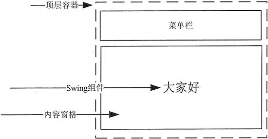
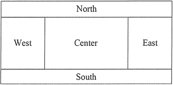

# Java Swing

## 主题一：Swing窗口容器和面板容器

### 1.JFrame窗口

JFrame 是 Swing 组件的顶层容器，该类继承了 AWT 的 Frame 类，支持 Swing 体系结构的高级 GUI 属性。

-   构造方法：

    -   JFrame()：构造一个初始时不可见的新窗体。
    -   JFrame(String title)：创建一个具有 title 指定标题的不可见新窗体。

-   JFrame类组件的布局组织示意图：

-   JFrame类中常用的方法：

| 方法名称                                                     | 概述                                                         |
| ------------------------------------------------------------ | ------------------------------------------------------------ |
| getContentPane()                                             | 返回此窗体的 contentPane 对象                                |
| getDefaultCloseOperation()                                   | 返回用户在此窗体上单击“关闭”按钮时执行的操作                 |
| setContentPane(Container contentPane)                        | 设置 contentPane 属性                                        |
| setDefaultCloseOperation(int operation)                      | 设置用户在此窗体上单击“关闭”按钮时默认执行的操作             |
| setDefaultLookAndFeelDecorated (boolean defaultLookAndFeelDecorated) | 设置 JFrame 窗口使用的 Windows 外观（如边框、关 闭窗口的 小部件、标题等） |
| setIconImage(Image image)                                    | 设置要作为此窗口图标显不的图像                               |
| setJMenuBar( JMenuBar menubar)                               | 设置此窗体的菜单栏                                           |
| setLayout(LayoutManager manager)                             | 设置 LayoutManager 属性                                      |

## 2.JPanel面板

JPanel 是一种中间层容器，它能容纳组件并将组件组合在一起，但它本身必须添加到其他容器中使用。

-   构造方法:
    -   JPanel()：使用默认的布局管理器创建新面板，默认的布局管理器为 FlowLayout。
    -   JPanel(LayoutManagerLayout layout)：创建指定布局管理器的 JPanel 对象。

-   JPanel类中常用的方法：

| 方法名及返回值类型                | 说明                           |
| --------------------------------- | ------------------------------ |
| Component add(Component comp)     | 将指定的组件追加到此容器的尾部 |
| void remove(Component comp)       | 从容器中移除指定的组件         |
| void setFont(Font f)              | 设置容器的字体                 |
| void setLayout(LayoutManager mgr) | 设置容器的布局管理器           |
| void setBackground(Color c)       | 设置组件的背景色               |

## 主题二：Swing布局管理器

### 1.边框布局管理器

BorderLayout（边框布局管理器）是 Window、JFrame 和 JDialog 的默认布局管理器。边框布局管理器将窗口分为 5 个区域：North、South、East、West 和 Center。其中，North 表示北，将占据面板的上方；Soufe 表示南，将占据面板的下方；East表示东，将占据面板的右侧；West 表示西，将占据面板的左侧；中间区域 Center 是在东、南、西、北都填满后剩下的区域。如图：

**Notes：**边框布局管理器并不要求所有区域都必须有组件，如果四周的区域（North、South、East 和 West 区域）没有组件，则由 Center 区域去补充。如果单个区域中添加的不只一个组件，那么后来添加的组件将覆盖原来的组件，所以，区域中只显示最后添加的一个组件。

-   构造方法:
    -   BorderLayout()：创建一个 Border 布局，组件之间没有间隙。
    -   BorderLayout(int hgap,int vgap)：创建一个 Border 布局，其中 hgap 表示组件之间的横向间隔；vgap 表示组件之间的纵向间隔，单位是像素。

### 2.流式布局管理器

FlowLayout（流式布局管理器）是 JPanel 和 JApplet 的默认布局管理器。FlowLayout 会将组件按照从上到下、从左到右的放置规律逐行进行定位。与其他布局管理器不同的是，FlowLayout 布局管理器不限制它所管理组件的大小，而是允许它们有自己的最佳大小。

-   构造方法：
    -   FlowLayout()：创建一个布局管理器，使用默认的居中对齐方式和默认 5 像素的水平和垂直间隔。
    -   FlowLayout(int align)：创建一个布局管理器，使用默认 5 像素的水平和垂直间隔。其中，align 表示组件的对齐方式，对齐的值必须是 FlowLayoutLEFT、FlowLayout.RIGHT 和 FlowLayout.CENTER，指定组件在这一行的位置是居左对齐、居右对齐或居中对齐。
    -   FlowLayout(int align, int hgap,int vgap)：创建一个布局管理器，其中 align 表示组件的对齐方式；hgap 表示组件之间的横向间隔；vgap 表示组件之间的纵向间隔，单位是像素。

### 3.卡片布局管理器

CardLayout（卡片布局管理器）能够帮助用户实现多个成员共享同一个显示空间，并且一次只显示一个容器组件的内容。

CardLayout 布局管理器将容器分成许多层，每层的显示空间占据整个容器的大小，但是每层只允许放置一个组件。

-   构造方法：
    -   CardLayout()：构造一个新布局，默认间隔为 0。
    -   CardLayout(int hgap, int vgap)：创建布局管理器，并指定组件间的水平间隔（hgap）和垂直间隔（vgap）。

### 4.网格布局管理器

GridLayout（网格布局管理器）为组件的放置位置提供了更大的灵活性。它将区域分割成行数（rows）和列数（columns）的网格状布局，组件按照由左至右、由上而下的次序排列填充到各个单元格中。

-   构造方法：
    -   GridLayout(int rows,int cols)：创建一个指定行（rows）和列（cols）的网格布局。布局中所有组件的大小一样，组件之间没有间隔。
    -   GridLayout(int rows,int cols,int hgap,int vgap)：创建一个指定行（rows）和列（cols）的网格布局，并且可以指定组件之间横向（hgap）和纵向（vgap）的间隔，单位是像素。

**Notes：**GridLayout 布局管理器总是忽略组件的最佳大小，而是根据提供的行和列进行平分。该布局管理的所有单元格的宽度和高度都是一样的。

### 5.网格包布局管理器

GridBagLayout（网格包布局管理器）是在网格基础上提供复杂的布局，是最灵活、 最复杂的布局管理器。GridBagLayout 不需要组件的尺寸一致，允许组件扩展到多行多列。每个 GridBagLayout 对象都维护了一组动态的矩形网格单元，每个组件占一个或多个单元，所占有的网格单元称为组件的显示区域。

GridBagLayout 所管理的每个组件都与一个 GridBagConstraints 约束类的对象相关。这个约束类对象指定了组件的显示区域在网格中的位置，以及在其显示区域中应该如何摆放组件。除了组件的约束对象，GridBagLayout 还要考虑每个组件的最小和首选尺寸，以确定组件的大小。

为了有效地利用网格包布局管理器，在向容器中添加组件时，必须定制某些组件的相关约束对象。GridBagConstraints 对象的定制是通过下列变量实现的。

-	gridx 和 gridy

用来指定组件左上角在网格中的行和列。容器中最左边列的 gridx 为 0，最上边行的 gridy 为 0。这两个变量的默认值是 GridBagConstraints.RELATIVE，表示对应的组件将放在前一个组件的右边或下面。

-	gridwidth 和 gridheight

用来指定组件显示区域所占的列数和行数，以网格单元而不是像素为单位，默认值为 1。

-	fill

指定组件填充网格的方式，可以是如下值：GridBagConstraints.NONE（默认值）、GridBagConstraints.HORIZONTAL（组件横向充满显示区域，但是不改变组件高度）、GridBagConstraints.VERTICAL（组件纵向充满显示区域，但是不改变组件宽度）以及 GridBagConstraints.BOTH（组件横向、纵向充满其显示区域）。

-	ipadx 和 ipady

指定组件显示区域的内部填充，即在组件最小尺寸之外需要附加的像素数，默认值为 0。

-	insets

指定组件显示区域的外部填充，即组件与其显示区域边缘之间的空间，默认组件没有外部填充。

-   anchor

指定组件在显示区域中的摆放位置。可选值有 GridBagConstraints.CENTER（默认值）、GridBagConstraints.NORTH、GridBagConstraints.
NORTHEAST、GridBagConstraints.EAST、GridBagConstraints.SOUTH、GridBagConstraints.SOUTHEAST、GridBagConstraints.WEST、GridBagConstraints.SOUTHWEST 以及 GridBagConstraints.NORTHWEST。

-	weightx 和 weighty

用来指定在容器大小改变时，增加或减少的空间如何在组件间分配，默认值为 0，即所有的组件将聚拢在容器的中心，多余的空间将放在容器边缘与网格单元之间。weightx 和 weighty 的取值一般在 0.0 与 1.0 之间，数值大表明组件所在的行或者列将获得更多的空间。

### 6.盒布局管理器

BoxLayout（盒布局管理器）通常和 Box 容器联合使用，Box 类有以下两个静态方法。

-   createHorizontalBox()：返回一个 Box 对象，它采用水平 BoxLayout，即 BoxLayout 沿着水平方向放置组件，让组件在容器内从左到右排列。
-   createVerticalBox()：返回一个 Box 对象，它采用垂直 BoxLayout，即 BoxLayout 沿着垂直方向放置组件，让组件在容器内从上到下进行排列。

Box 还提供了用于决定组件之间间隔的静态方法：

| 网格包布局                                        | 说明                                         |
| ------------------------------------------------- | -------------------------------------------- |
| static Component createHorizontalGlue()           | 创建一个不可见的、可以被水平拉伸和收缩的组件 |
| static Component createVerticalGlue()             | 创建一个不可见的、可以被垂直拉伸和收缩的组件 |
| static Component createHorizontalStrut(int width) | 创建一个不可见的、固定宽度的组件             |
| static Component createVerticalStrut(int height)  | 创建一个不可见的、固定高度的组件             |
| static Component createRigidArea(Dimension d)     | 创建一个不可见的、总是具有指定大小的组件     |

-   构造方法：
    -   BoxLayout(Container c,int axis)：其中，参数 Container 是一个容器对象，即该布局管理器在哪个容器中使用；第二个参数为 int 型，用来决定容器上的组件水平（X_AXIS）或垂直（Y_AXIS）放置，可以使用 BoxLayout 类访问这两个属性。