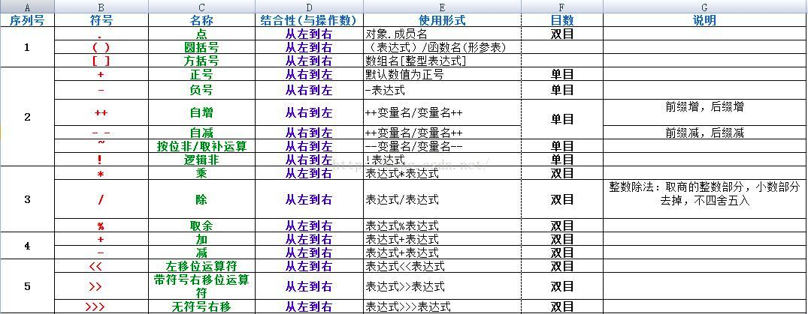
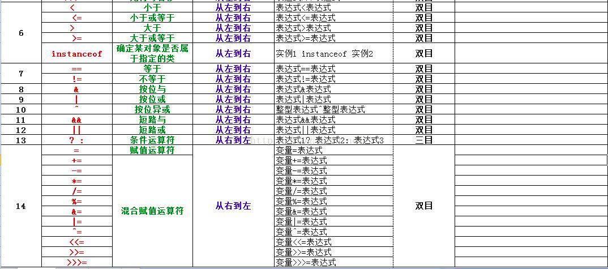

# Java基本数据类型
### 内置数据类型
八种基本类型。  
- byte

8位，有符号数据，byte变量占用的空间只有int类型的四分之一。
- short

16位，有符号数据，short变量是 int的二分之一。
- int

32位，有符号数据。
- long

64位，有符号数据。
- float

单精度，32位。
- double

双精度，64位。
- boolean

ture和false。
- char

单一的16位Unicode字符。
### 引用数据类型
- 由类的构造函数创建，用以访问所引用的对象。
- 对象，数组都是引用数据类型。所有引用类型的默认值都是null.
- 一个引用变量可以用来引用与任何与之兼容的类型。

### Java常量
常量是一个固定值，常量指不能改变的值。在Java中使用final标志。声明方式和变量类似：
```
final double PI = 3.1415926;
```
byte、int、long、short都可以使用十进制、16进制以及8进制表示。前缀`0`表示8进制，前缀`0x`表示16进制。
### Java转义字符
| 符号 | 字符含义 |
| :-: | :-: |
| \n	| 换行 (0x0a) |
| \r	| 回车 (0x0d) |
| \f	| 换页符(0x0c) |
| \b	| 退格 (0x08) |
|  \s	| 空格 (0x20) |
| \t	| 制表符 |
| \" | 双引号 |
| \'	| 单引号 |
| \\	| 反斜杠 |
| \ddd	| 八进制字符 (ddd) |
| \uxxxx	| 16进制Unicode字符 (xxxx) |
### Java变量声明
声明格式：
```
type identifer [ = value][, indentifier [= value] ...]; 
```
type为Java数据类型，identifier是变量名，使用逗号隔开声明多个同类型变量。
Java语言支持的变量类型：
- 局部变量
- 成员变量
- 类变量

#### 局部变量
- 声明在方法、构造方法或者语句块中
- 局部变量在方法、构造方法、语句块被执行的时候创建，当它们执行完成后，变量将会被销毁
- 访问修饰符不能用于局部变量
- 局部变量只能在声明它的方法、构造方法或语句块中可见
- 局部变量在栈上分配
- 局部变量没有默认值，局部变量在被声明后，必须经过初始化。


#### 实例变量
- 在类中，但在方法、构造方法和语句块之外
- 在对象创建的时候创建，在对象销毁的时候销毁
- 实例变量可以声明在使用前或者使用后
- 访问修饰符可以修饰实例变量
- 实例变量对于类中的方法、构造方法或者语句块是可见的。一般情况下应该把实例变量设为私有。通过使用访问修饰符可以使实例变量对子类可见。

#### 类变量
- 类变量为静态变量使用static关键字声明
- 静态变量存储在静态存储区
- 静态变量在程序开始时创建，在程序结束时销毁

### Java修饰符
#### 访问修饰符
- 默认的，default，在同一包内可见，不使用任何修饰符
- 私有的，private，在同一类可见
- 共有的，public，对所有类可见
- 受保护的，protected，对同一包内的类和所有子类可见


#### 非访问修饰符
- static，创建类方法和类变量
- final，用来修饰类、方法、变量，final修饰的类不能被继承，修饰的方法不能被重定义
- abstract，用来创建抽象类和抽象方法
- synchronized和volatile，用于线程的编程

### Java运算符

